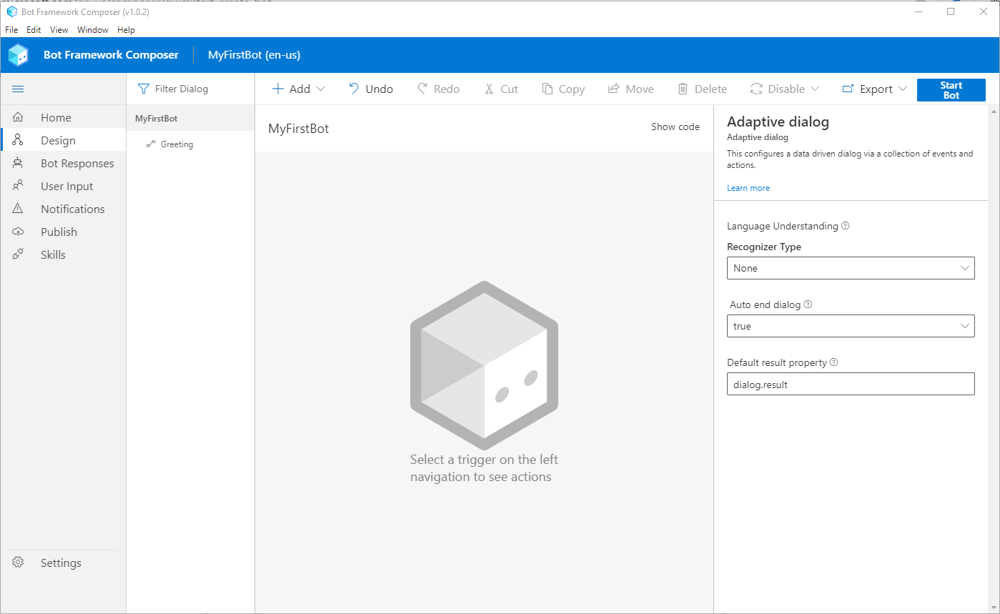
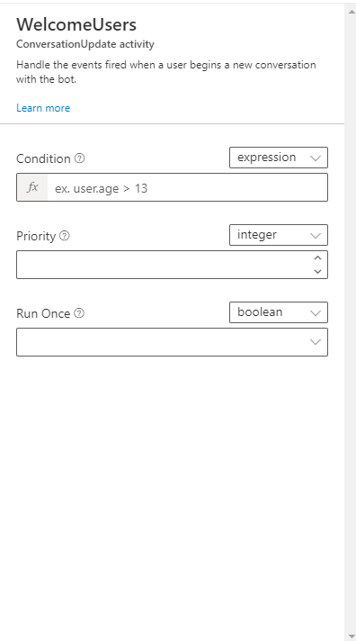
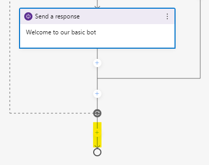

# Exercise - Create a Bot with the Bot Framework Composer

## Create a basic bot with Composer

1. Ensure that you have installed the prerequisites and the Bot Framework Composer.
1. Start the Bot Framework Composer.
1. On the **Home** screen, select **New**.
1. Select the radio button for **Create from scratch**.
1. Select **Next**.
1. In the **Define conversation objective** dialog, change the default **Name** to **MyFirstBot**, or a name of your choosing.
1. Select the **Location** on your computer to store the bot.
1. Provide a **Description** of the bot.
1. Select **OK**.
1. The Composer will generate some framework aspects of your bot and then open the bot in the interface.

    

1. Under **Filter Dialog**, select **Greeting**.
1. The designer opens in the middle of the Composer interface with some content already populated. This content in the designer, represents the *ConversationUpdate** activity that is called when a user joins a conversation with the bot. The designer shows that the bot will loop for each item (members added), includes a branch segment that will handle recipient IDs, and then a response item.
1. You can edit the title of **Greeting** by selecting the word **Greeting** in the properties pane on the right and typing in a new value.  Select the **Greeting** text and change it to **WelcomeUsers**.

    

1. In the designer pane, select the **Send a response** component.
1. In the **Properties** pane on the right, change the default text *${WelcomeUser()}*  to **Welcome to our basic bot.**
1. In the **Designer** pane, locate the **+** symbol just above the circle in the bottom of the diagram and select it.

    

1. A list of components is displayed.  Select **Ask a question** from the list.
1. In the designer, select the **Bot Asks (Text)** component.
1. In the **Properties** pane on the right, enter the text, **Enter your first name** in the **Prompt for text** section.
1. In the **Properties** pane, select the **User Input** option next to **Bot Asks** and enter **user.name**. The option will set up a variable that you can access later in the bot conversation.

    

1. Back in the **Designer** pane, select the **+** symbol under the **User Input(Text)** component.
1. Select the **Send a response** option.
1. In the **Designer** pane, select the newly added **Send a response** component.
1. In the **Properties** pane, enter the following text, **Hello ${user.name}, nice to meet you**.
1. Your simple bot is complete so now let's test it.
1. Select the **Start Bot** button in the upper right-hand corner of Composer.
1. You will notice **Reloading** indicated next to the button as the bot is compiled and started.
1. When it completes, a **Test in Emulator** option is available next to the button. 
1. A Windows Firewall dialog may display. Select both check boxes on the **Windows Firewall** dialog and select **OK**.
1. In the Bot Framework Composer, select **Test in Emulator**.
1. Wait for the Bot Emulator to start and watch the log window.  You will notice the URL and port that the bot is listening on.
1. After a short pause, you will see the welcome message and the prompt to enter your first name.  Enter you first name and press **Enter**.
1. The bot should respond with the **Hello *firstname*, nice to meet you**.
1. You have created your first simple bot with the Bot Framework Composer and tested it with the Bot Framework Emulator.
