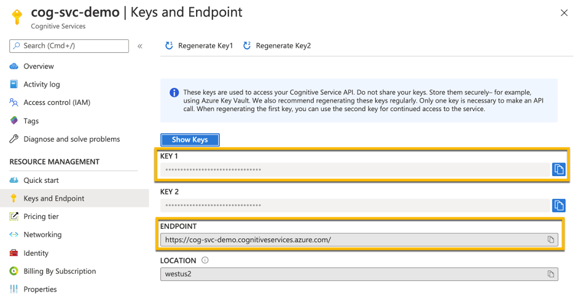
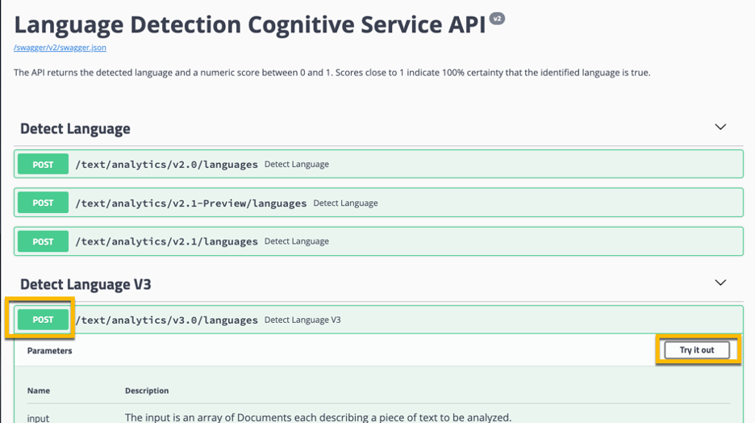
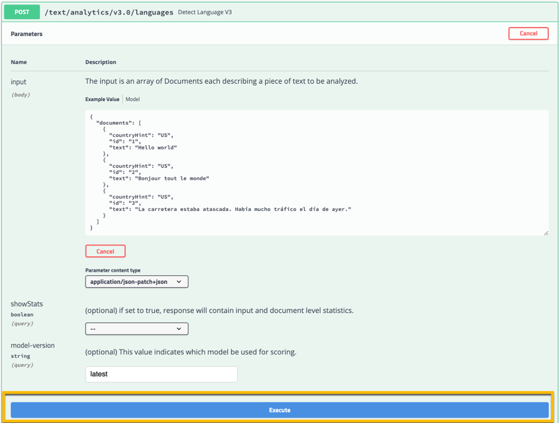
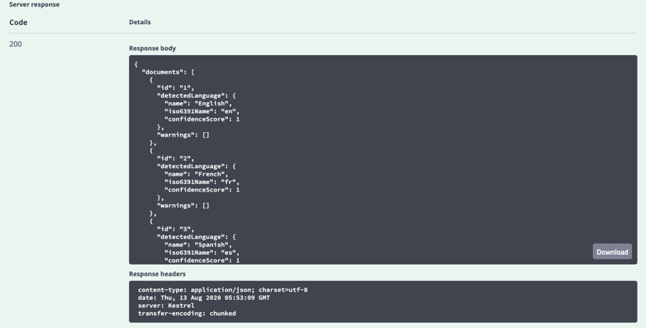

# Exercise - Create Containers for Reuse

## Set up services (Azure CLI)

Before you can complete the exercises in this lesson, you will need to have some core services in place.  Run the following commands from the Azure CLI to create the services necessary. It is recommended that you do this in the Azure portal but you can download the [Azure CLI](https://docs.microsoft.com/cli/azure/install-azure-cli?view=azure-cli-latest) locally and run it from your computer as well.

>[!Note]
>You may have to change the names of these resources to avoid naming conflicts in Azure.

### Azure Resource Group

```azurecli
az group create --name cogContainerRG --location westus2
```

### Text Analytics service

```azurecli
az cognitiveservices account create --kind TextAnalytics --resource-group cogContainerRG --name textAnalyticsContainerGer --location westus2 --sku S0
```

### Azure Container registry

```azurecli
az acr create --resource-group cogContainerRG --name textAnalyticsConReg --sku Basic
```

### Azure Kubernetes service

```azurecli
az aks create \
    --resource-group cogContainerRG \
    --name textAnalyticsAKS \
    --node-count 2 \
    --generate-ssh-keys \
    --attach-acr textAnalyticsConReg
```

## Gather required parameter values

You will need to retrieve two required values: **subscription key** and **endpoint**. The Azure Cognitive Service, in this scenario Text Analytics, should have been created in Azure. The Azure endpoint needs to exist even though the model is included in the container. The endpoint is used for billing and metering only, not for processing data.

Your specific Cognitive Services subscription key and service endpoint (for billing purposes) need to be provided. These can be retrieved by browsing to the Cognitive Services instance in Azure Portal and copying the values from the Keys and Endpoint section. You will need these values for building the custom image in the next exercise.

  

## Create Containers for Reuse

When configuring containers for Cognitive Services, you start with the images that are available in Microsoft Container Registry. You can use these images without modifying the definition. However, the default image requires passing in certain configurations. To make running the container easier you will create a container image that includes our custom settings. This image can be reused without passing the configuration values each time. 

### Create a container image

You create a Dockerfile to define a custom container image with your settings built-in. This file references the parent image in the FROM statement and then applies additional settings based on environment variables. The path you will use points to the language detection image in the Microsoft Container Registry. The ARG statements will let you pass in values during the build step. The steps would be similar for other Cognitive Services images.

Let’s build a docker image for language detection:

1. Copy and paste the following text into a file named Dockerfile.
FROM mcr.microsoft.com/azure-cognitive-services/language
ARG key
ARG billing_endpoint
ENV apikey=$key
ENV billing=$billing_endpoint
ENV eula=accept

1. Set two environment variables, replacing <subscription_key> and <service-name> with your own values. You will use these each time you build your image.

export COGNITIVE_SERVICE_KEY=<subscription_key>
export COGNITIVE_SERVICE_ENDPOINT=https://<service-name>.cognitiveservices.azure.com/

1. Build the image from the Dockerfile, using the image name cog-svc-language which is used in the next section.

```bash
docker build --build-arg key=$COGNITIVE_SERVICE_KEY --build-arg billing_endpoint=$COGNITIVE_SERVICE_ENDPOINT -t cog-svc-language
```

The output from the build statement will show the steps completed and end with success messages.

```dos
Successfully built 49379c513da1
Successfully tagged cog-svc-language:latest
```

### Run your container

Now you can run a container using this image on your local machine. The docker run command will take the image name and start a Docker container. This is typical for application development and testing. Then you can test from the browser to confirm the service works. You access the swagger UI to test the API.

1. From the console, run the following command to run a container.

```bash
docker run --rm -it -p 5000:5000 cog-svc-language
```

1. Open your browser and navigate to http://0.0.0.0:5000/swagger.

1. Select **Post** on one of the V3 endpoints, then choose **Try it out**.

  

1. Select **Execute**, which posts the request to your container.

  

1. View the response.



You have successfully built a Docker image, run it as a local container, and tested the containerized Cognitive Services endpoint using Swagger. Next you will decide how to deploy this container to Azure where other applications can use it.
