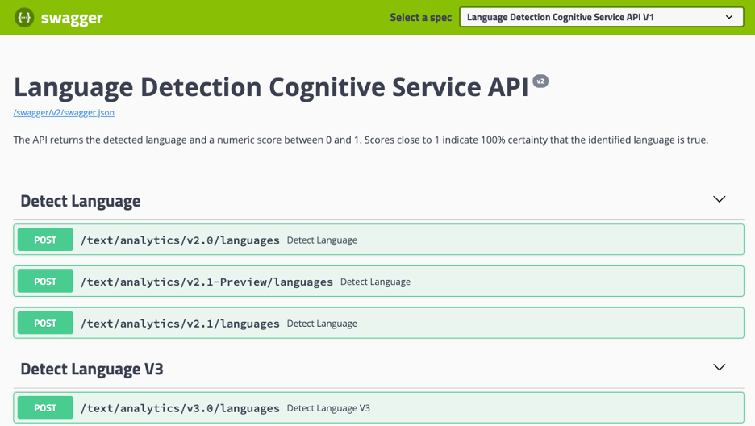

# Exercise: Deploy a container

For the health care application, you would deploy a language detection container in coordination with other containers. For example, one container may be the customer facing web app and another would run the model to recommend treatments. Since multiple containers will be deployed together, you will choose Kubernetes. Remember that the application is designed to work on-premises or in Azure, so Kubernetes fits the need. You will do the task in two parts, which are detailed below: publish a container image and deploy to Azure Kubernetes Service.

## Publish Docker images to Azure Container Registry

For the first step in deployment, you will tag the Docker image and publish to Azure Container Registry.

1. Use Azure CLI to log in and retrieve the Container Registry address by replacing <acr_name> and <resource_group> with your resource names.

```azurecli
az acr login --name <acr-name>

az acr list --resource-group <resource-group> --output table
```

The output of these commands includes your login server name, in this case cogsvcacr.azurecr.io

|NAME | RESOURCE GROUP | LOCATION | SKU | LOGIN SERVER |
| ----- | ------ | ------ | ----- | ------ |
| cogsvcacr | cognitive-services-demo-rg | westus2 | Basic | cogsvcacr.azurecr.io |

>[!Note]
>If at any point you receive error unauthorized: authentication required then run the login command again.

1. Next, find the correct docker image to publish. Use the image you created in the previous section, named cog-svc-language.

```azurecli
docker images
```

Output:

```bash
REPOSITORY			TAG			IMAGE ID
cog-svc-language	latest		49379c513da1
```

1. Tag the docker image by adding the login server and push the tagged image to the Azure Container Registry. The operation may take several minutes. Be sure to replace <login-server> and <service-image-name> with the correct values.

```azurecli
docker tag <service-image-name> <login-server>/cog-svc:v1
docker push <login-server>/cog-svc:v1
```

## Deploy to Azure Kubernetes Service

To deploy to Kubernetes, you need a manifest file. This file defines the desired deploy state, including which image, port, billing endpoint, and API key will be used. In a complete project, the file will include additional resources that interact with your Cognitive Services container. However, for this example you will deploy the single Cognitive Service container and use it from your local application.

1. Create the manifest file by copying following YAML and save as cog-svc.yml.  

```yml
apiVersion: v1
kind: Service
metadata:
  name: cog-svc
spec:
  selector:
    app: cog-svc
  type: LoadBalancer
  ports:
  - name: cog-svc
    port: 5000
    targetPort: 5000
    protocol: TCP
---
apiVersion: apps/v1
kind: Deployment
metadata:
  name: cog-svc
spec:
  replicas: 1
  selector:
    matchLabels:
      app: cog-svc
  template:
    metadata:
      labels:
        app: cog-svc
    spec:
      containers:
      - name: cog-svc
        image: <login-server>/cog-svc:v1>
        ports:
        - name: public-port
          containerPort: 5000
        livenessProbe:
          httpGet:
            path: /status
            port: public-port
          initialDelaySeconds: 30
          timeoutSeconds: 1
          periodSeconds: 10

      automountServiceAccountToken: false
```

1. In the cog-svc.yml file that was created, replace the value for image with the full name of the tagged container.

```yml
containers:
- name: cog-svc
  image: cogsvcacr.azurecr.io/cog-svc:v1
```

Now let’s use Azure CLI commands with an existing Azure Kubernetes Service to run the container.

1. Install **kubectl**, the command-line interface for working with Kubernetes.

```azurecli
az aks install-cli
```

1. You will authenticate to Azure Kubernetes Service before deploying the containers. Azure CLI provides a way to store Kubernetes Service credentials by appending to the file <user-home>/.kube/config. Retrieve and store the credentials for the Azure Kubernetes Service with the following command, replacing <resource-group> and <aks-name> with your values.
az aks get-credentials --resource-group <resource-group> --name <aks-name>

1. Run the deploy with the apply command.

```azurecli
kubectl apply -f cog-svc.yml
```

The output of the apply command is:

```azurecli
service/cog-svc created
deployment.apps/cog-svc created
```

If your output does not show that the application was created, check that your credentials are set and that your network location is allowed to access the Kubernetes service.

1. To test out the service, you need the public IP address. Run the following command to confirm the service is running and retrieve the public IP.

```azurecli
kubectl get service cog-svc
```
kubectl get service cog-svc

The output from this command includes the EXTERNAL-IP and PORT:

```azurecli
NAME      TYPE           CLUSTER-IP   EXTERNAL-IP     PORT(S)          AGE
cog-svc   LoadBalancer   10.0.4.255   51.143.48.153   5000:30629/TCP   61s
```

1. A simple test from the browser will confirm you can access the service and run API commands using the swagger UI. Open your browser to http://<external-ip>:5000/swagger to test it out.

  

In this simple deployment, we included a public port, which makes this container accessible to everyone. This is not how you will want to deploy a long running container. You will learn about securing the container and deployment in the next section.

## Cleanup
If you are not moving on to the next exercise immediately, remove Azure Kubernetes Services to avoid charges.

1. To delete the Azure Kubernetes Service, you can use Azure CLI command:

```azurecli
az aks delete --name <aks-name> --resource-group <resource-group>
```
