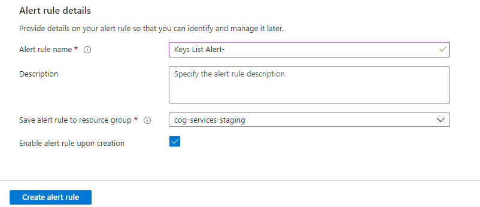
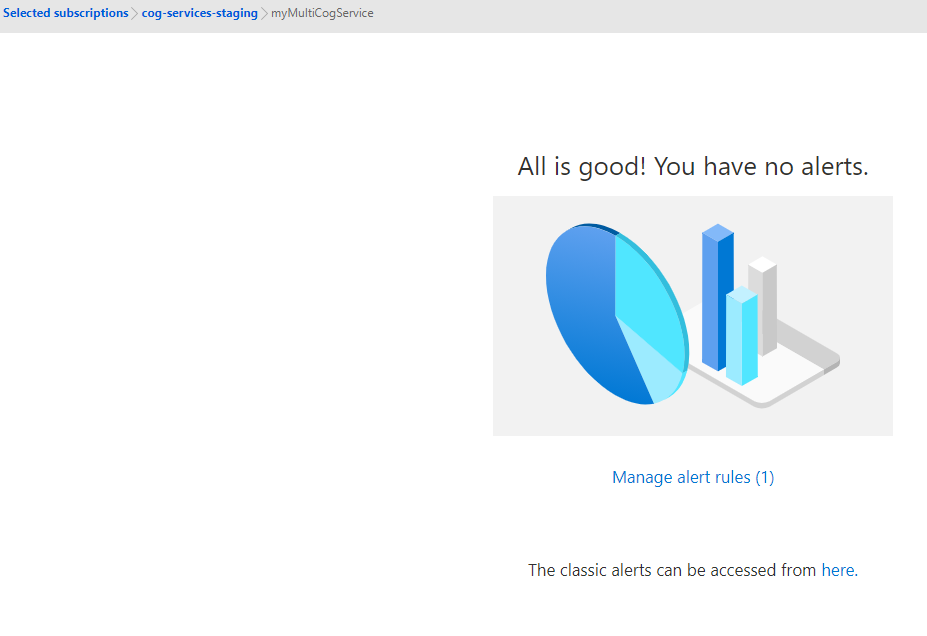
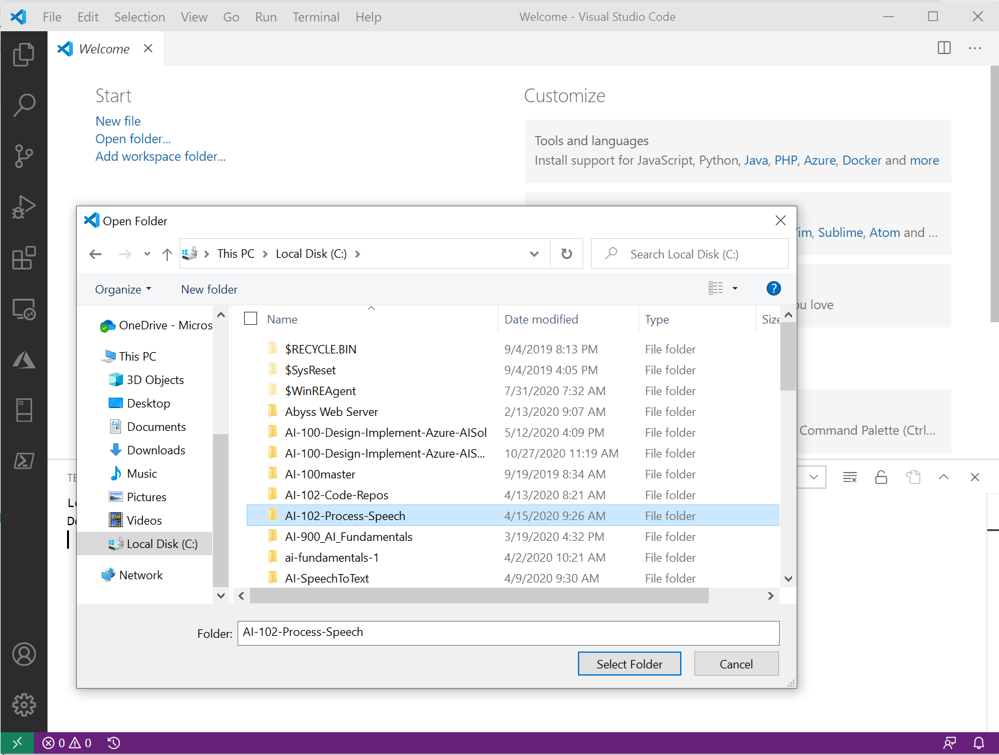
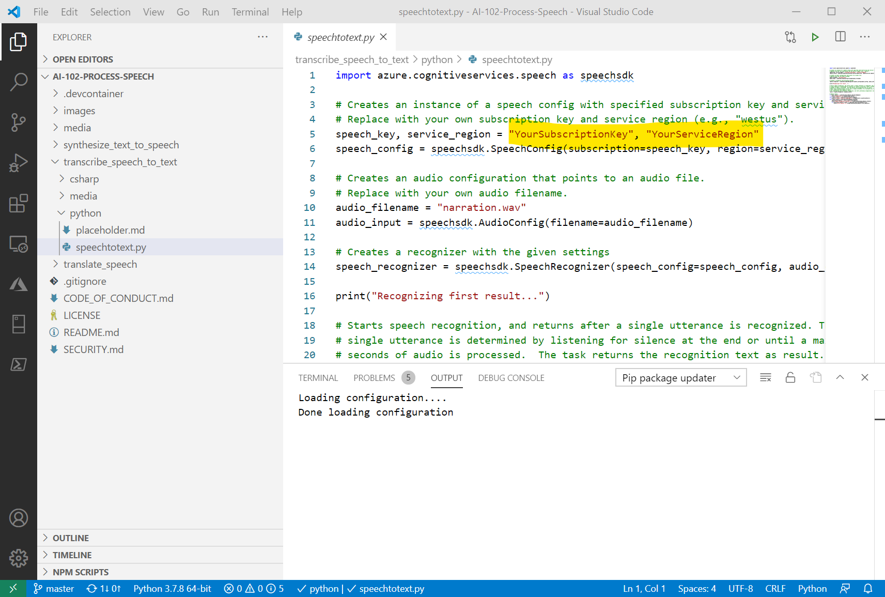

# Montor your Azure Cognitive Resource with Diagnostics and Logging

The exercise will cover how to create a simple alert.  Once the alert is in place, an Azure CLI command will be executed against the resource to trigger the alert.  A review of the alert page will show the details of what occurred.  To get a deeper insight into the severity levels and how to work with the various other types of alerts, visit the [alerts overview](https://docs.microsoft.com/azure/azure-monitor/platform/alerts-overview?toc=%2Fazure%2Fazure-monitor%2Ftoc.json) page.

### Configure an Alert

1. Sign in to the [Azure portal](https://portal.azure.com).
1. Locate your Cognitive Service resource in your dashboard or the resources page.
1. Under the **Monitoring** section, select **Alerts**
1. Select **+ New alert rule**
1. Verify that the proper Cognitive Service resource is selected under **Resource**

    
    
1. Select the **Select Condition** button under **Condition**
1. In the **Configure signal logic** page that appears on the right, you can narrow the **Signal type** by selecting the drop-down list and choosing a category.  There are two choices, **Metrics** and **Activity Log**.  Select **Activity Log** from the drop-down list
1. From the filtered list, select the **List Keys** option
1. Leave the default **Chart period** set to **Over the last 6 hours**
1. Leave the remaining options at their default and select the **Done** button
1. Alerts serve their purpose best when someone is notified that the event has occurred.  We do not have any notification groups or email address configured at this time.  Because the **Action Groups** section is optional, do not configure it at this time unless you already have an Action group configured.
1. In the **Alert Details** section, enter **Keys List Alert** for the Alert rule name.
1. Select **Create alert rule**

    
    
1. Azure will create the new Alert
1. Refresh the page. Azure will tell you that **All is good! You have no alerts**.

    
    
1. Open an Azure CLI Cloud Shell by selecting the **Cloud Shell** icon in the top nav bar
1. Wait until Azure has requested the Cloud Shell and connected to a terminal
1. Enter the following command,

    ```azurecli
    az cognitiveservices account keys list --name myMultiCogService --resource-group cog-services-staging
    ```

    >[!NOTE]
    >If you have previously created a Read-only lock on your resource, you will need to remove that lock first or this command will fail.

1. On your **Alert page**, change the **Time range** to **Past hour** by selecting from the drop-down list.
1. You should see a **Sev 4** alert listed in the table.

>[!Note]
>You might have to wait 3 to 5 minutes and refresh the page, before seeing the alerts that are generated from running the CLI command above.

1. Select that Sev 4 alert, bottom of the list, to open a detailed view on the alert.

## Create a Metric

1. Ensure you are signed in to you Azure subscription with the Azure portal open
1. Locate you Cognitive Service resource, in this example we use the myMultiCogService that we have used in the module
1. In the **Monitoring** section, locate and select **Metrics**
1. Select **+ New chart**
1. A new chart opens allowing your select the metrics you want to monitor
1. Ensure the correct Cognitive Service is selected in the **Scope** entry
1. Leave the default **Metric namespace**
1. Select the drop down menu for **Metric**
1. As the list opens, hover the mouse cursor over each entry to display a pop-up that explains the purpose of the metric.  Note the metrics for **Characters translated** and **Characters trained**.  These metrics would help you monitor a service that performing translation services or training models. The information available in these metrics would help you understand some of your billing or get an idea of the costs associated for these services.
1. Select **Total Calls**
1. In the **Aggregation** list, select **Count**.  This will allow you to monitor the total calls to you Cognitive Service resource which is useful in determining how much the service is being used over a period of time.
1. You can also choose a different chart type, look into the logs, or pin the chart to the dashboard for easy viewing, with the options in the chart header bar.

    

1. You can leave this metric in your Cognitive Service and view the results when you create an application that accesses the resource. There will be no results displayed at this time.

    

## Create a Diagnostic Setting

>[!NOTE]
>You must have an existing storage account created before completing this exercise.  If you do not have any storage accounts configured yet, follow the instructions on [this page](https://docs.microsoft.com/azure/storage/common/storage-account-create?tabs=azure-portal) to create one, in the region your service is created, before proceeding with the exercise.

1. After creating a metric for monitoring total calls for the Cognitive Service, you also want to send that metric data to a diagnostic destination.
1. Sign in to your Azure subscription and open your Cognitive Service resource.
1. Under the **Monitoring** section, select **Diagnostic settings**.
1. Select **+ Add diagnostic setting**.
1. For the **Diagnostic settings name**, enter the value **Log Total Calls**.
1. Under **Category details**, select the **AllMetrics** option.  This will include all metrics that you have configured for this service.
1. To help reduce the costs of dealing with the diagnostic settings, select the option **Archive to a storage account**.  This allows you to archive the metric data for later evaluation at a reduced cost, when compared to using a Log Analytics Workspace.
1. Once you select **Archive to a storage account**, you are required to enter some extra information. This relates to the storage account that will be used for the data and the number of days to retain the data.
1. Because you are concerned about **Metrics**, enter **30** in the **Retention (days)** location next to **AllMetrics**.
1. Under the **Destination details** section, notes are displayed letting you know that you will be charged data rates for the storage of the metric data and another note telling you that all storage accounts are displayed.
1. Select the appropriate subscription from **Subscription** list.
1. Select an existing storage account from the **Storage account** list.  Note that you must select an existing storage account.  The option to create a new one, from this page, is not possible.
1. Select the **Save** button.
1. Data will not be sent to storage account until you have successfully made calls to the Cognitive Service, to which the Metrics are applied.

## Create a Log Analytics Workspace

1. Sign in to your Azure Subscription.
1. Select your Cognitive Service.
1. Under the **Monitoring** section, select **Logs**.
1. To create a log for monitoring your resource, you require a **Log Analytics Workspace**.
1. You can either select the **+ Add** button in the top nav bar or you can select the **Create log analytics workspace** button in the main page of the Logs panel.
1. Ensure that your active subscription is selected in the **Subscription** option.
1. Select an appropriate **Resource Group**, such as **cog-services-staging**.
1. Provide a descriptive name for the Log, example **Multi-cog-serv-log-ga** using your own initial in place of **ga** to ensure a unique name.
1. Select a **Region** to store the logs.  This should be a region that is appropriate for the log files but is typically the same region as your resources are deployed in.
1. Select the **Next: Pricing Tier**
1. The available options may depend on region and subscription level.  For more details on the pricing plans, see the [Log Analytics Pricing](https://go.microsoft.com/fwlink/?linkid=871069) page.
1. Select **Review + Create** unless you want to add tags for reference.  If you want to add tags, select the **Next:Tags** button and enter the appropriate information.
1. Watch the **status** at the top of the page and when it turns green and indicates **Validation passed**, select **Create** at the bottom of the page.
1. Once the workspace is deployed, select the **Go to resource** button.
1. To learn about the various options for accessing the logs collected, follow the links in the **Get started with Log Analytics** section to explore all the options available.  This course does not teach how to connect to or query the log analytics workspace data.

### Test your Metrics Report

In order to test the metrics, you will run a small Python application using Visual Studio Code.  The details of the application are not important at this stage in the course as you will be covering Text Analytics in later lessons.  This code is merely calling the the speech to text translation feature of Text Analytics so you can see a Cognitive Service access in the metrics report.

1. If you do not already have Visual Studio Code installed, [download](https://code.visualstudio.com/Download) and install it.
1. When installation is complete, open Visual Studio Code.
1. Either clone or dowload a zip of this GitHub repo, `https://github.com/MicrosoftLearning/AI-102-Process-Speech`.
1. Open the folder you used for this repo on the local computer.

    
    
1. If you get any messages about installing additional extensions or components, choose to do so.
1. Open the **transcribe_speech_to_text** folder.
1. Open the **python** folder.
1. Select the **speechtotext.py** file in the explorer pane.
1. Locate the **YourSubscriptionKey**, **YourServiceRegion** line in the file and paste your key into the proper spot and set the region to where you created your **myMultiCogService**, such as **westus**.

    
    
1. Select the **Run Python File in Terminal** button in the button bar or right-click in the Python code window and choose **Run Python File in Terminal**.
1. An error wlil be generated because we have not added the appropriate package for the Azur Cognitive Services required for this functionality. However, doing this also opens an integrated terminal at the bottom of the Visual Studio Code window with the Python environment configured and set as the default terminal.

>[!Note]
>If the Python terminal is not configured automatically, follow the instructions located in [this lesson](https://github.com/MicrosoftLearning/AI-102-Design-Implement-AI-Solution/blob/main/Module-Two/L00_00-environment-setup.md) to complete the configuration, then come back and complete this exercise.

1. You will need to add a package for the Cognitive Services speech functions so in the open terminal window in VS Code, paste the following command and hit Enter to add the package: `pip install --upgrade azure-cognitiveservices-speech`

    
    
1. Locate the **Run Python File in Terminal** button in the upper right corner of VS Code Online and select it to run the code.
1. Run the code three or four more times to ensure we have more than one access of the service.
1. The result of the speech to text transcription is displayed in the terminal window.  Feel free to download the **narration.wav** file from the GitHub repo if you want to hear the audio that was used.
1. Switch to the browser tab that contains your Cognitive Service resource.
1. Select the **Metrics** option under **Monitoring**.
1. Ensure that the **Scope** is still set to your Cognitive Service resource.
1. Select **Total Calls** in the **Metric** drop down.
1. Select the **Count** option from the drop down for **Aggregation**.
1. Towards the right of the chart, you should notice a line spike indicating the number of calls that you triggered using the code in this exercise.
