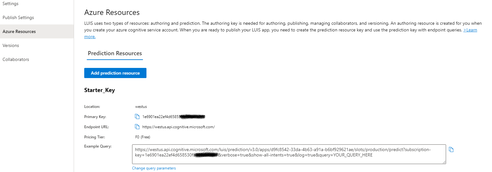

# Exercise - Create and Manage LU Keys

## Create a prediction key

1. Sign in to your LUIS portal.
1. Select the LUIS app that you want to create the prediction key for.
1. Select the **Manage** option in the top toolbar.
1. Select **Azure Resources** in the left tool bar.
1. Unless you have already created a prediction key, your screen should look similar to this. The key information is obscured on purpose.  
   
   

    >[!NOTE]
    > Azure services are updated on a regular basis and screen shots are representative of the state at the time of the course authoring.  Screen shots may differ if the service has had changes since the content creation.

1. To create a new **Prediction key**, select the **Add prediction resource** button.
1. Select the **Subscription Name** that you will associate with your LUIS prediction resource.
1. Select an existing **LUIS resource name** if you have already created a LUIS resource in the Azure portal and then select **Done**.

   >[!TIP]
   >Existing resources will be listed in the drop-down that are valid for the region in which your subscriptions exist.  You can choose a **LUIS** resource from this list, if one exists already.

1. If you do not have an existing **LUIS** resource available, you can select the **Create new resource** to create a new **LUIS** resource.  When selecting this option, complete the information fields in the dialog that is displayed to create your new LUIS resource.
1. Once your new prediction resource is created, you will notice a couple of key aspects,
    - You now have a new **Primary Key** and **Secondary Key** associated with the prediction resource
    - There is a new **Endpoint URL** available.
        - In the **Starter Key**, the endpoint URL starts with the region, such as westus.api.cognitiveservices.....
        - In the new **Prediction** resource, the endpoint URL starts with the name of the LUIS resource such as, gerai-102luis.cognitiveservices.....
1. Notice that the **pricing tier** is no longer set at **F0 (Free)** but instead has changed to **S0 (Standard)**.  This correlates to the discussion earlier in the topic about the number of requests supported.

## Programmatically create and manage LUIS apps

There are various APIs and SDK options that you can use to create and manage LUIS apps.  The support varies by programming language.  Some aspects are available via REST and others via the SDK options.  For current support of the SDK and API options, view the sample code and information found on the [LUIS Samples Git hub Repository](https://github.com/Azure-Samples/cognitive-services-language-understanding).
