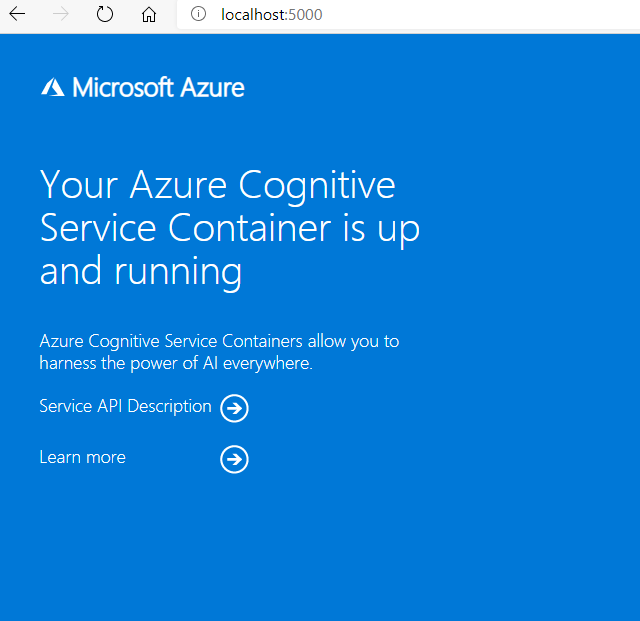

# Exercise - Install and Run LUIS Containers

Before you can place your LUIS app in a container, you need to ensure that you have satisfied the prerequisites.  The necessary prerequisites are listed here.

- [Download](https://www.docker.com/get-started) and install Docker for your host platform
- Either your own LUIS exported for containers file, or the [sample file](https://github.com/MicrosoftLearning/AI-102-LUIS/raw/master/314a24df-7cfd-40e1-a417-cec549a39db7_v0%20(1).1.gz) that was created for you
- If you do not already have a LUIS application created, you will need to create one for access to the **Key** and **endpoint URI**.  You can create a LUIS resource in Azure, sign into the LUIS portal, and extract and import this [LUIS application](https://github.com/MicrosoftLearning/AI-102-LUIS/raw/master/PicBot-One%2006_29_2020%2018_12_46.zip) to create the necessary resources for this exercise
- A folder on the host computer containing an input and an output folder
- The input folder will be used to store the exported LUIS app gzip file
- The output folder is where LUIS will store the endpoint logs

As you access the LUIS app in this container, the endpoint hits will result in a log file being created in the output folder.  You can import the endpoint logs back into your LUIS app in the portal for active learning, based on your endpoint queries in the containerized version of LUIS.

## Prepare the Docker container

1. Ensure that Docker is installed and running on the host computer.
1. Open PowerShell on the host computer, or a bash terminal on Linux or Mac.
1. Get the container image using **docker pull**.

    ```powershell
    docker pull mcr.microsoft.com/azure-cognitive-services/luis:latest
    ```

1. Create a folder on the host computer with a descriptive name such as **LUIS_Container**.
1. Create a folder named **input** inside the **LUIS_Container** folder.
1. Create a folder named **output** inside the **LUIS_Container** folder.
1. Copy, or move, the exported LUIS app gzip file to the **input** folder.  Do not modify or extract the contents of this file.  Leave the gzip file intact as it was exported from the LUIS portal.
1. You are now ready to import the LUIS app and run the container.  You will use the following command to achieve import the app.

    ```powershell
    docker run --rm -it -p 5000:5000 --memory 4g --cpus 2 --mount type=bind,src=c:\input,target=/input
    --mount type=bind,src=c:\output\,target=/output
    mcr.microsoft.com/azure-cognitive-services/luis
    Eula=accept
    Billing={ENDPOINT_URI}
    ApiKey={API_KEY}
    ```

1. Before you can run this command, you need to modify some of the parameters.

    - change ```the --mount type=bind,src=c:\input, target=/input``` line to include the path to the input folder you created earlier
    - change the ```--mount type=bind,src=c:\output\,target=/output``` line to include the path to the output folder you created earlier
    - depending on your host computer, you may be able to modify the amount of memory and CPUs.  The current values are the recommended usage
    - paste your endpoint URI and key in the placeholders.  The3 values are taken from your LUIS resource in Azure.

    >[!WARNING]
    >You may receive a series of errors if Docker is not setup for proper file sharing.  To ensure Docker has access to the folders you created, follow the steps outlined here.
    >Open Docker settings
    >Go to Resources and File Sharing
    >Add the **LUIS_Container** folder to the sharing options

### Important notes about the command

Do not change the order of the arguments unless you are familiar with docker containers. If you are using a different operating system than Windows, use the correct console/terminal, folder syntax for mounts, and line continuation characters for your system. This example assumes a Windows PowerShell environment and the command should be all on one line. Because the container is a Linux operating system, the target mount uses a Linux-style folder syntax.

The command:

- Runs a container from the LUIS container image
- Loads LUIS app from input mount at C:\LUIS_Container\input, located on container host
- Allocates two CPU cores and 4 gigabytes (GB) of memory
- Exposes TCP port 5000 and allocates a pseudo-TTY for the container
- Saves container and LUIS logs to output mount at C:\LUIS_Container\output, located on container host
- Automatically removes the container after it exits. The container image is still available on the host computer.

1. Assuming no errors are generated, the command will complete successfully and start the container.
1. You can open a browser and visit localhost:5000, which is the port you assigned to the container.
1. If all was successful, you should see a message that your container is running.



1. You can now query the LUIS app using the endpoint that is available.  An example of a query using CURL and a V3 endpoint, is presented here.
1. Get the AppID from your LUIS portal and paste it in the placeholder in the command.

    ```bash
    curl -G \
    -d verbose=false \
    -d log=true \
    --data-urlencode "query=Can I get a 5x7 of this image?" \
    "http://localhost:5000/luis/v3.0/apps/{APP_ID}/slots/production/predict"
    ```

1. If you are using a V2 endpoint, run the following CURL command instead. Note that *staging* is set to false so if your endpoint is on a staging slot, set the staging parameter to true.
1. Get the AppID from your LUIS portal and paste it in the placeholder in the command.

    ```bash
    curl -X GET \
    "http://localhost:5000/luis/v2.0/apps/{APP_ID}?q=can%20I%20get%20an%20a%205x7%20of%20this%20image&staging=false&timezoneOffset=0&verbose=false&log=true" \
    -H "accept: application/json"
    ```

1. After querying your endpoint with your test data, you will find the endpoint logs in the output directory.
1. You can import these logs into the LUIS app in the portal for active learning.
