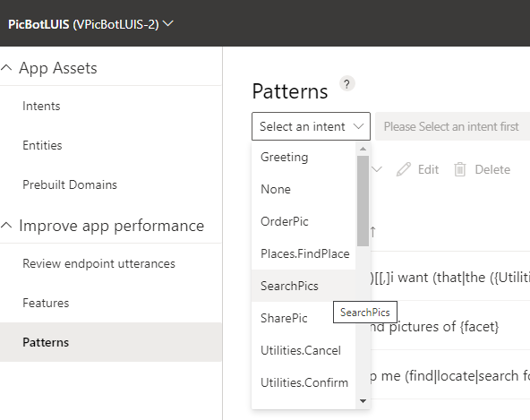

# Exercise - Scripting Automation

## Add a pattern

In this example, consider the use of a LUIS app that helps you search for pictures.  Perhaps you want to search for pictures with certain types of places such as a beach or a coffee shop. You can add the prebuilt entity of Places.PlaceType to your LUIS application. Once the prebuilt entity is in place, you can create a pattern.

1. Sign in to your LUIS portal.
1. Select the **LUIS app** that you want to modify.
1. Select **Build** on the top toolbar to open the build screen.
1. If you do not already have the **Places.PlaceType** prebuilt entity in your app, continue with the next set of steps, otherwise skip to step 9.
1. Select **Entities** in the left toolbar.
1. Select **Add prebuilt domain entity** under the **Entities** header.
1. Enter **Places.PlaceType** and select that entry from the list.
1. Select **Done**.  The prebuilt entity is now added to your LUIS app.
1. Locate the **Places.PlaceType** entity in your LUIS app.
1. Select the entity name and then select **Examples**.
1. Review the entries and note the specific aspects that are called out as **Places.PlaceType**.  You will use this information to help identify appropriate patterns.
1. While you are still on the **Build** page, select **Patterns** in the left toolbar.
1. The first step in adding a pattern is to determine the **Intent** that it will apply to. In this example, we want to focus on the ability to search for pictures.
1. Select **SearchPic** from the **Select an intent** drop-down.

1. Now, you will enter a template for the pattern.
1. Select inside the text box that states **Type in templates of what you expect your users to say and hit Enter**.
1. Begin entering the pattern using this example:

   *help me find pictures of {*

1. Once you type the open curly brace, the LUIS portal responds by displaying a pop-up dialog that lists the entices you can select from.  Scroll through the list and select the **Places.PlaceType** prebuilt entity.
1. LUIS completes the template by adding the entity and closing the curly brace for you.
1. Press **Enter** to complete the pattern entry and have it added to your patterns.
1. Your **Patterns** screen should look similar to this image.

