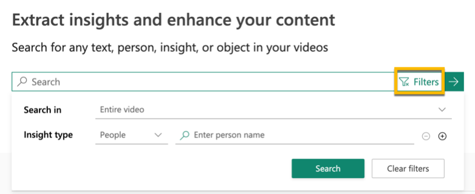
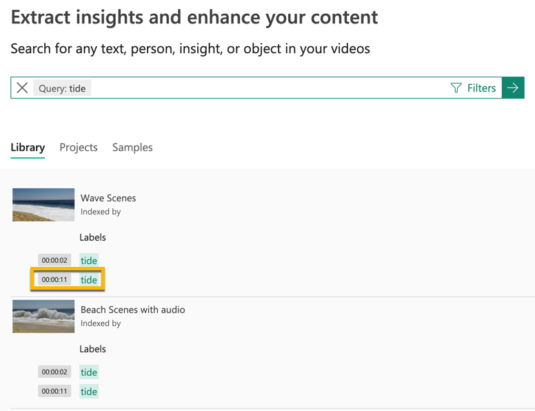

# Exercise - Find Moments in Video Files

## Search from the Video Indexer portal

Let’s look at how to search videos in the portal.

1. Sign in to the Video Indexer Portal from your web browser.
1. Enter a term in the search box and optionally select Filters to refine the search criteria more. Submit search by hitting enter or selecting the green arrow.

    

1. The results may include full videos or specific scenes. Selecting the video name will take you to the start of the video. Selecting one of the timestamps will start the video at the identified moment.

    

## Search with the API

Let’s look at how to use the API for programmatic searches.

### Using Python

1. Use similar code as the previous section to set up the client and get an access token.
1. Import required libraries.

    ```python
    import requests
    import os
    ```

1. Add this client code to your main class.

    ```python
    account_id = os.environ["VIDEO_INDEXER_ACCOUNT"]
    location = os.environ["VIDEO_INDEXER_LOCATION"]
    api_key = os.environ["VIDEO_INDEXER_API_KEY"]
    api_url = "https://api.videoindexer.ai"

    headers = {"Ocp-Apim-Subscription-Key": api_key}

    access_token_url = "{0}/auth/{1}/Accounts/{2}/AccessToken?allowEdit=true".format(api_url, location, account_id)
    access_token_result = requests.get(access_token_url, headers=headers)
    account_access_token = access_token_result.json()
    ```

1. Add the code for a get call to the Search endpoint. Replace the surfing part of the searchQueryString with your own value.
1. Add this query code to your main class.

    ```python
    search_query_string = "query=surfing"
    base_url = "{0}/{1}/Accounts/{2}".format(api_url, location, account_id)
    search_url = "{0}/Videos/Search?accessToken={1}&{2}".format(
        base_url, account_access_token, search_query_string)

    search_result = requests.get(search_url)

    print("Search Results:")
    print(search_result.json())
    ```

1. View output. You will get a results array where each item is a video. For each video, you will see a searchMatches array. If the match was because of a label that applies to the whole video the startTime for the match will be “00:00:00”.

    Example results array with some attributes removed:

    ```json
    "results":
    [{
    	"id": "66de3cd83e",
    	"name": "Beach Scenes",
    	"durationInSeconds": 14,
    	"searchMatches": [{
	      "startTime": "00:00:01.1000000",
	      "text": "wave",
	    },
	    {
	      "startTime": "00:00:11.7000000",
	      "text": "wave",
	    }]
     }]
    ```

### Using C-Sharp

1. Use similar code as the previous section to set up the client and get an access token.
1. Import required libraries.

    ```csharp
    using System;
    using System.IO;
    using static System.Environment;
    using System.Net.Http;
    using Newtonsoft.Json;
    ```

1. Add this client setup code to your main class.

    ```csharp
    // Get configs from environment variables
    var accountId = GetEnvironmentVariable("VIDEO_INDEXER_ACCOUNT"); 
    var location = GetEnvironmentVariable("VIDEO_INDEXER_LOCATION");
    var apiKey = GetEnvironmentVariable("VIDEO_INDEXER_API_KEY"); 
    var apiUrl = "https://api.videoindexer.ai";

    // Create http client and get access token
    System.Net.ServicePointManager.SecurityProtocol = System.Net.ServicePointManager.SecurityProtocol | System.Net.SecurityProtocolType.Tls12;
    var handler = new HttpClientHandler(); 
    handler.AllowAutoRedirect = false; 
    var client = new HttpClient(handler);
    client.DefaultRequestHeaders.Add("Ocp-Apim-Subscription-Key", apiKey); 

    var accountAccessTokenRequestResult = client.GetAsync($"{apiUrl}/auth/{location}/Accounts/{accountId}/AccessToken?allowEdit=true").Result;
    var accountAccessToken = accountAccessTokenRequestResult.Content.ReadAsStringAsync().Result.Replace("\"", "");

    client.DefaultRequestHeaders.Remove("Ocp-Apim-Subscription-Key");
    ```

1. Add the code for a get call to the Search endpoint. Replace the surfing part of the searchQueryString with your own value.
1. Add this query code to your main class.

    ```csharp
    var searchQueryString = "query=surfing";
    var searchRequestResult = client.GetAsync($"{apiUrl}/{location}/Accounts/{accountId}/Videos/Search?accessToken={accountAccessToken}&{searchQueryString}").Result;
    var searchResult = searchRequestResult.Content.ReadAsStringAsync().Result;
    Console.WriteLine("Search Results:");
    Console.WriteLine(JsonConvert.DeserializeObject<dynamic>(searchResult));
    ```

1. View output. You will get a results array where each item is a video. For each video, you will see a searchMatches array. If the match was because of a label that applies to the whole video the startTime for the match will be “00:00:00”.

    Example results array with some attributes removed:

    ```json
    "results":
    [{
    	"id": "66de3cd83e",
    	"name": "Beach Scenes",
    	"durationInSeconds": 14,
    	"searchMatches": [{
	      "startTime": "00:00:01.1000000",
	      "text": "wave",
	    },
	    {
	      "startTime": "00:00:11.7000000",
	      "text": "wave",
	    }]
     }]
    ```
